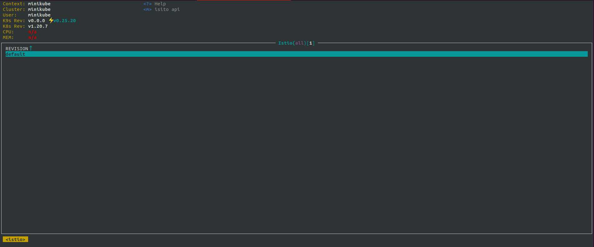
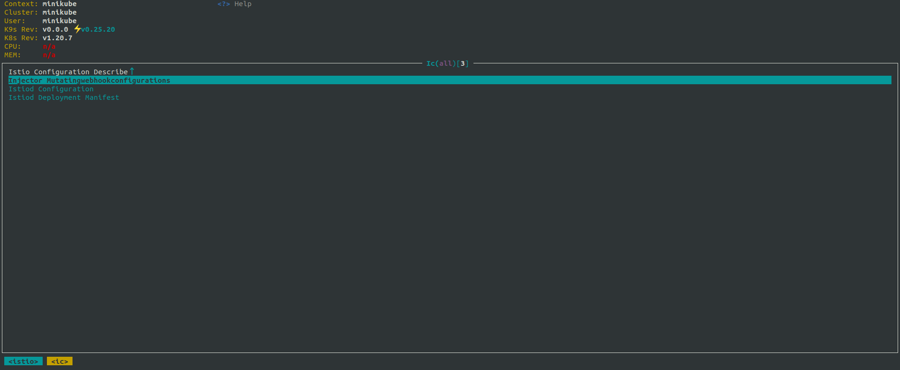
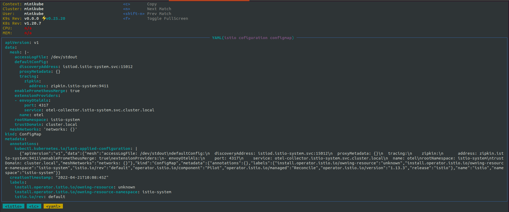
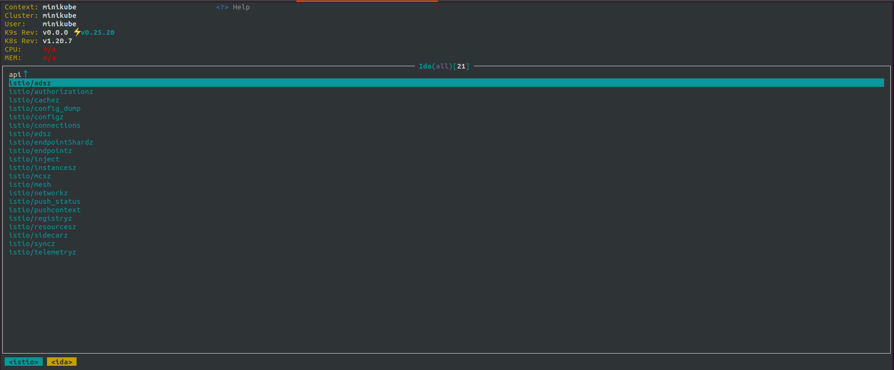
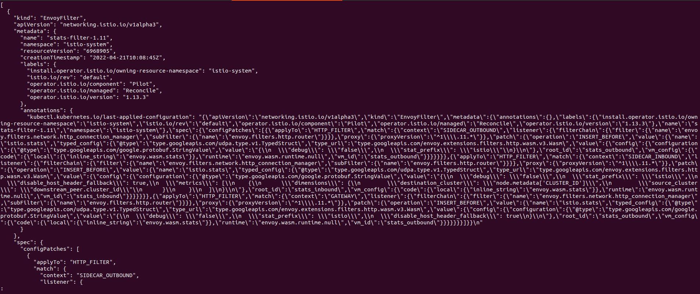
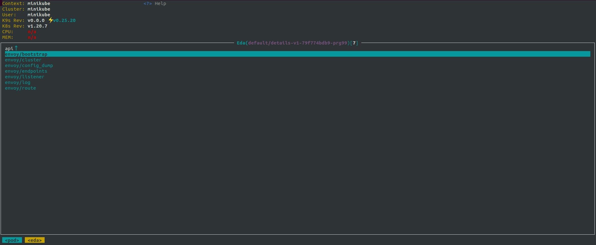

# I9S

------

- [I9S](#i9s)
  - [站在巨人的肩膀](#站在巨人的肩膀)
  - [运维场景](#运维场景)
  - [i9s介绍](#i9s介绍)
  - [运行方式](#运行方式)
  - [操作方式](#操作方式)
  - [规划](#规划)


## 站在巨人的肩膀

开发`i9s`的初衷是提高服务网格的运维效率，我们希望有一款工具可以像 [k9s](https://github.com/derailed/k9s) 管理`k8s`资源那样，可视化的管理`istio`。得益于`k9s`代码的可扩展性， 我们基于[k9s-v0.25.18](https://github.com/derailed/k9s/releases/tag/v0.25.18) 的代码，进行了二次开发，提供了`istio`资源可视化以及调试接口的能力，再次感谢`k9s`。

## 运维场景

常常遇到的场景是，某服务治理规则不生效，需要排查。可能会分以下几个步骤进行排查：

1. 查找服务`pods`, 查看`envoy`的`config_dump`. 一般来说会先查找`pod`, 这里以`view`服务为例

   ```
   kubectl -n skiff-demo-sidecar get pods
   demo-stock-viewer-sidecar-8547788687-lk48m       2/2     Running   0          15d
   ```

2. 执行`envoy debug`命令查看 `config_dump`文件

   ```
   kubectl -n skiff-demo-sidecar exec demo-stock-viewer-sidecar-8547788687-lk48m -- curl 127.0.0.1:15000/config_dump | less
   ```

3. 这时候会遇到类似`config_dump`中没有相关配置文件，控制面是否下发的问题

4. 目标转移到控制面，查找`istio pod`

   ```
   kubectl -n istio-system get pods
   istiod-112-5fb95d6fff-k94pz            1/1     Running     0          46h
   ```

5. 然后首先看`istio`中是否有该配置

   ```
   k exec istiod-112-5fb95d6fff-k94pz -- curl 127.0.0.1:15014/debug/configz | less
   ```

6. 如果发现没有配置，可能是`istio`的上层问题（没下发）。如果是`istio`的问题，可以接着看下发到 view 服务的实际数据是否正常

   ```
   kubectl -n istio-system exec istiod-112-5fb95d6fff-k94pz -- curl 127.0.0.1:15014/debug/config_dump?proxyID=demo-stock-viewer-sidecar-8547788687-lk48m | less
   ```

7. 到这步基本就能判断出问题出在了控制面还是数据面

8. 接下来可能需要更具体的排查

## i9s介绍

`i9s`的宗旨是提高`istio`的运维效率，从运维场景章节可以看到，配置是否下发问题的定位就需要多个`kubectl`交互命令，而`i9s`可以极大提升该过程的查询效率。目前`i9s`提供的功能包括

- `istio` 调试接口，包括`configz`,`adsz`,`config_dump` 等接口信息查看

- `enovy` 调试接口，包括`config_dump`,`cluster`,`endpoints` 等接口信息查看

- `revision`查看，从`revision`视角提供注入规则、deployment资源清单、`mesh`配置文件等信息

  


## 运行

前提：需要指定`kubeconfig`, 且目前以适配1.12为主, 由于不同版本接口不同，可能导致查询其他版本的接口时出现问题。

镜像方式(需要将kubeconfig文件挂载进容器内)

```
docker run -it --net=host -v $HOME/.kube/config:/root/.kube/config slimeio/i9s:v0.0.1
```

由于有些`minikube` 权限问题，可能需要将`kubeconifg`中指定的`client-key`的目录一同挂进容器

## 操作方式

- 按下 `:istio` 切换至`isito revision`视图，可以选在不同`rev`



- 选中`rev`按下 `enter` 进入`rev`详情页面, 包含注入规则、`deployment`清单和`mesh configuration`



- 选中`istiod configuratiojn`按下 `enter` 展示了`mesh` 配置项详情



- 在`istio revision` 视图下，选中`rev`并按下`m`(mesh)进入`isito api`视图， 展示可调试的`istio`接口列表



- 选中`istio/configz`按下 `enter`展示`debug/configz`信息, 支持`less`操作，按`q`退出



- 选中服务（接入网格的服务）所在`pod`并按下`m`(mesh) 进入`envoy api`视图，展示可调试的`envoy`接口信息



- 选中`envoy/config_dump`进入`/config_dump` 接口，支持`less`操作，按`q`退出


## 规划

`i9s` 提供了`istio`可视化基础操作能力, 之后计划结合`istioctl`和`isito`提供配置的分析统计能力，持续演进。

